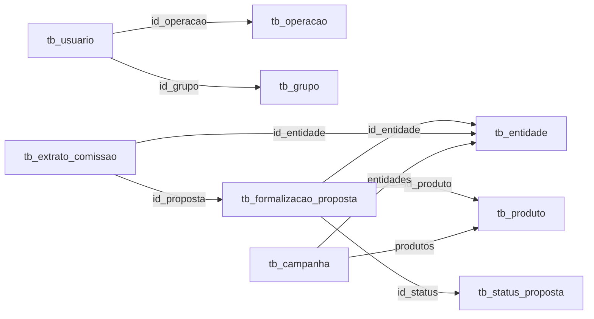

# Database Features & New Opportunities
## Análise Completa do Banco de Dados para Novas Funcionalidades

> **Banco**: `esteira_dev_hub_teste` (PostgreSQL)  
> **Total de Tabelas**: 168 tabelas  
> **Data de Análise**: 25/11/2025

---

## 📊 Visão Geral do Banco de Dados

### Principais Entidades do Sistema

O banco de dados contém uma arquitetura complexa de **sistema de crédito/empréstimo** com gestão de:

1. **Usuários** - Gestão de acesso e permissões
2. **Operações** - Produtos financeiros/crédito
3. **Propostas** - Formalizações e contratos
4. **Comissões** - Extratos e pagamentos
5. **Entidades** - Correspondentes bancários/parceiros
6. **Campanhas** - Metas e bonificações
7. **Logs e Auditoria** - Rastreabilidade completa

---

## ✅ Funcionalidades Já Implementadas

### 1. **Gestão de Usuários** ✓
**Tabela**: `tb_usuario`  
**Status**: ✅ Implementado

**Features Atuais**:
- ✅ Criar, editar, bloquear, excluir usuários
- ✅ Busca por nome, login, email, CPF
- ✅ Consultas em linguagem natural via AI
- ✅ Dashboard com métricas de usuários
- ✅ Listagem e filtros

**Campos Utilizados**:
- `id_usuario`, `str_descricao`, `str_login`, `email`, `str_cpf`
- `bloqueado`, `str_ativo`, `dh_edita`
- `id_operacao`, `id_grupo`

---

## 🚀 Novas Funcionalidades Possíveis

### Categoria: 🟢 FÁCIL (1-3 dias)
Implementação rápida com dados já disponíveis

---

### 1. **Dashboard de Operações**
**Tabelas**: `tb_operacao`, `tb_usuario`  
**Complexidade**: 🟢 Fácil

**Descrição**: Painel gerencial mostrando distribuição de usuários por operação.

#### Schema da Tabela
```sql
tb_operacao:
- id_operacao (PK)
- str_descricao (nome da operação)
- str_documento (CNPJ)
- str_ativo (A/E/I)
- config (JSONB - configurações)
```

#### Features
- 📊 Gráfico: Usuários por Operação
- 📈 KPI: Total de operações ativas
- 📊 Tabela: Top operações por número de usuários
- 🔍 Filtrar usuários por operação específica

#### Consultas AI Possíveis
```
"Quantos usuários temos na operação X?"
"Mostre todas as operações ativas"
"Liste usuários da operação FGTS"
```

#### Dados Disponíveis
- **Total de Operações**: Consulta `SELECT COUNT(*) FROM tb_operacao WHERE str_ativo = 'A'`
- **Relação**: `tb_usuario.id_operacao` → `tb_operacao.id_operacao`

---

### 2. **Dashboard de Grupos**
**Tabelas**: `tb_grupo`, `tb_usuario`  
**Complexidade**: 🟢 Fácil

**Descrição**: Visualização de hierarquia e distribuição de grupos.

#### Schema da Tabela
```sql
tb_grupo:
- id_grupo (PK)
- str_descricao (nome do grupo)
- id_operacao (operação relacionada)
- excecao (boolean - grupo de exceção)
- ordem (prioridade/ordem)
- str_observacao
```

#### Features
- 📊 Gráfico: Usuários por Grupo
- 📋 Hierarquia de grupos por operação
- 🎯 Grupos de exceção (flag especial)
- 📊 Distribuição de usuários em pirâmide organizacional

#### Consultas AI Possíveis
```
"Quantos usuários tem no grupo Gerencial?"
"Liste todos os grupos da operação X"
"Mostre grupos de exceção"
```

---

### 3. **Relatório de Auditoria de Usuários**
**Tabelas**: `log_alteracoes`, `tb_usuario`  
**Complexidade**: 🟢 Fácil

**Descrição**: Timeline de alterações em usuários.

#### Schema da Tabela
```sql
log_alteracoes:
- Logs automáticos via triggers
- Registros de INSERT, UPDATE, DELETE
```

#### Features
- 📅 Timeline de mudanças por usuário
- 👤 Quem alterou cada registro
- 📝 Histórico de valores antigos vs novos
- 🔍 Buscar alterações por data/usuário

#### Consultas AI Possíveis
```
"Mostre histórico de alterações do usuário X"
"Quem modificou o email do fulano?"
"Liste todas alterações de hoje"
```

---

### Categoria: 🟡 MÉDIO (3-5 dias)
Requer integração entre múltiplas tabelas

---

### 4. **Dashboard de Propostas (CRM Financeiro)**
**Tabelas**: `tb_formalizacao_proposta`, `tb_formalizacao`, `tb_status_proposta`  
**Complexidade**: 🟡 Médio

**Descrição**: Painel completo de acompanhamento de propostas de crédito.

#### Schema Principal
```sql
tb_formalizacao_proposta:
- id_proposta (PK)
- str_proposta (número da proposta)
- n_valorliquido, n_valorcontrato, n_valorparcela
- n_prazo (meses)
- id_status (status atual)
- id_produto (tipo de crédito)
- id_convenio (banco/convênio)
- id_entidade (correspondente)
- dt_averbacao
- dh_concluido, dh_cancelado, dh_pago
- str_matricula, str_cpf
```

#### Features Implementáveis

**A. Dashboard Executivo**
- 📊 KPIs:
  - Total de propostas
  - Valor total contratado
  - Ticket médio
  - Taxa de conversão
  - Propostas concluídas vs canceladas
  
- 📈 Gráficos:
  - Propostas por status (funil de vendas)
  - Volume financeiro por mês
  - Propostas por produto
  - Propostas por convênio
  - Propostas por entidade/correspondente

**B. Gestão de Propostas via AI**
```
"Mostre propostas aguardando aprovação"
"Qual o valor total de propostas pagas esse mês?"
"Liste propostas canceladas do fulano"
"Quantas propostas FGTS temos ativas?"
"Mostre propostas acima de R$ 50.000"
```

**C. Filtros Avançados**
- Por status
- Por faixa de valor
- Por período (inclusão, conclusão, pagamento)
- Por produto
- Por convênio
- Por correspondente

---

### 5. **Sistema de Comissões**
**Tabelas**: `tb_extrato_comissao`, `tb_extrato_comissao_lote`, `tb_tabela_comissao_valor`  
**Complexidade**: 🟡 Médio

**Descrição**: Gestor completo de extratos e pagamentos de comissão.

#### Schema Principal
```sql
tb_extrato_comissao:
- id_extrato (PK)
- id_proposta (proposta relacionada)
- id_entidade (correspondente)
- id_tipo_comissao (tipo)
- n_valor (valor da comissão)
- pct_comissao (percentual)
- n_valor_liquido (líquido após impostos)
- n_valor_ir, n_valor_iss (impostos)
- id_status (status de pagamento)
- bloqueado (bloqueado para pagamento)
- dh_pago (data de pagamento)
- id_lote (lote de pagamento)
```

#### Features Implementáveis

**A. Dashboard Financeiro**
- 💰 KPIs:
  - Total a pagar
  - Total pago no mês
  - Comissões bloqueadas
  - Valores por correspondente
  - IR e ISS retidos
  
- 📊 Gráficos:
  - Comissões por status
  - Evolução de pagamentos
  - Top correspondentes por comissão
  - Distribuição de impostos

**B. Gestão via AI**
```
"Quanto devo de comissão para o parceiro X?"
"Mostre comissões pendentes de pagamento"
"Qual total de IR retido esse mês?"
"Liste comissões bloqueadas"
"Gere relatório de comissões pagas em novembro"
```

**C. Funcionalidades**
- Liberação/bloqueio de comissões
- Geração de lotes de pagamento
- Cálculo automático de impostos
- Conciliação proposta ↔ comissão

---

### 6. **Gestão de Entidades (Correspondentes/Parceiros)**
**Tabelas**: `tb_entidade`, `tb_entidade_email`, `tb_entidade_telefone`, `tb_entidade_endereco`  
**Complexidade**: 🟡 Médio

**Descrição**: CRUD completo de correspondentes bancários.

#### Schema Principal
```sql
tb_entidade:
- id_entidade (PK)
- str_descricao (nome/razão social)
- str_documento (CNPJ/CPF)
- id_tipo (tipo de entidade)
- str_logo, str_icone, str_cor (branding)
- custom (JSONB - dados customizados)

tb_entidade_email:
- id, id_entidade, str_email

tb_entidade_telefone:
- id, id_entidade, str_telefone, id_tipo_telefone

tb_entidade_endereco:
- id, id_entidade, str_cep, str_logradouro, etc.
```

#### Features Implementáveis
- 📋 Listagem de entidades/correspondentes
- ➕ Cadastro com dados completos
- ✏️ Edição de informações
- 📞 Gestão de contatos (múltiplos emails/telefones)
- 📍 Gestão de endereços
- 📊 Dashboard: Performance por entidade
- 🎨 Customização visual (logo, cor)

**Consultas AI**:
```
"Liste todos os correspondentes ativos"
"Cadastre novo parceiro fulano, CNPJ X"
"Atualize telefone do parceiro Y"
"Mostre endereço da entidade Z"
```

---

### 7. **Campanhas e Metas**
**Tabelas**: `tb_campanha`, `tb_campanha_apuracao`, `tb_campanha_premio`  
**Complexidade**: 🟡 Médio

**Descrição**: Sistema de campanhas de incentivo e bonificação.

#### Schema Principal
```sql
tb_campanha:
- id_campanha (PK)
- str_descricao
- id_status (ativa/inativa)
- id_tipo (tipo de campanha)
- dt_vigencia_ini, dt_vigencia_fim
- periodo_apuracao (mensal/trimestral)
- metas (JSONB - metas configuradas)
- convenios, produtos, entidades (JSONB - filtros)
- n_prioridade_pagamento
```

#### Features Implementáveis
- 📋 Listagem de campanhas ativas
- 📊 Dashboard: Performance de campanhas
- 🎯 Acompanhamento de metas
- 🏆 Ranking de participantes
- 💰 Premiações acumuladas
- 📅 Calendário de vigências

**Consultas AI**:
```
"Mostre campanhas ativas"
"Qual minha posição na campanha X?"
"Quanto falta para bater a meta?"
"Liste prêmios da campanha Y"
```

---

### Categoria: 🔴 COMPLEXO (5-10 dias)
Requer lógica de negócio avançada

---

### 8. **Sistema de Consultas e Simulações**
**Tabelas**: `tb_consulta`, `tb_consulta_lote`, `tb_consulta_lote_dado`, `tb_cache_consulta`  
**Complexidade**: 🔴 Complexo

**Descrição**: Gestão de consultas de crédito e simulações.

#### Features
- 📊 Dashboard de consultas realizadas
- 📈 Volume de consultas por período
- 💾 Cache de consultas (otimização)
- 📄 Consultas em lote
- 🔍 Histórico por CPF

---

### 9. **Formalizações e Fluxos**
**Tabelas**: `tb_formalizacao`, `tb_formalizacao_fase`, `tb_formalizacao_historico`, `tb_formalizacao_conversa`  
**Complexidade**: 🔴 Complexo

**Descrição**: Acompanhamento de processos de formalização.

#### Features
- 🔄 Visualização de fluxos de processo
- 📊 Dashboard de fases
- 💬 Chat/conversas da formalização
- 📋 Timeline de eventos
- 📄 Gestão de documentos anexos

---

### 10. **Sistema de Documentos**
**Tabelas**: `tb_formalizacao_documento`, `tb_formalizacao_proposta_doc`, `tb_integracao_documento`  
**Complexidade**: 🔴 Complexo

**Descrição**: Gerenciamento de documentos de propostas.

#### Features
- 📎 Upload de documentos
- ✅ Validação e aprovação
- 🔍 Análise de documentos (OCR)
- 📊 Status de documentação
- 🗂️ Organização por proposta

---

## 🎯 Roadmap Sugerido de Implementação

### Sprint 1 (Semana 1) - Fundação
- ✅ **Gestão de Usuários** (já implementado)
- 🟢 **Dashboard de Operações**
- 🟢 **Dashboard de Grupos**

### Sprint 2 (Semana 2) - Auditoria e Relatórios
- 🟢 **Relatório de Auditoria**
- 🟡 **Gestão de Entidades/Parceiros**

### Sprint 3 (Semana 3-4) - Core Business
- 🟡 **Dashboard de Propostas (CRM)**
- 🟡 **Sistema de Comissões**

### Sprint 4 (Semana 5-6) - Gamificação
- 🟡 **Campanhas e Metas**
- 🔴 **Sistema de Consultas**

### Sprint 5 (Semana 7-8) - Processos Avançados
- 🔴 **Formalizações e Fluxos**
- 🔴 **Sistema de Documentos**

---

## 📋 Tabelas Relevantes por Módulo

### Módulo: Usuários e Acesso
```
tb_usuario, tb_usuario_perfil, tb_perfil, tb_perfil_role, 
tb_role, tb_menu, tb_log_acesso
```

### Módulo: Operações e Estrutura
```
tb_operacao, tb_grupo, tb_grupo_operacao, tb_operacao_produto,
tb_operacao_fluxo, tb_operacao_fase
```

### Módulo: Propostas e CRM
```
tb_formalizacao, tb_formalizacao_proposta, tb_formalizacao_historico,
tb_formalizacao_status, tb_status_proposta, tb_formalizacao_conversa
```

### Módulo: Financeiro/Comissões
```
tb_extrato_comissao, tb_extrato_comissao_lote, 
tb_tabela_comissao, tb_tabela_comissao_valor,
tb_tipo_comissao, tb_status_extrato
```

### Módulo: Parceiros/Entidades
```
tb_entidade, tb_entidade_email, tb_entidade_telefone,
tb_entidade_endereco, tb_entidade_documento,
tb_entidade_hierarquia, tb_corban
```

### Módulo: Campanhas
```
tb_campanha, tb_campanha_apuracao, tb_campanha_premio,
tb_campanha_status, tb_campanha_tipo
```

### Módulo: Consultas
```
tb_consulta, tb_consulta_lote, tb_cache_consulta,
tb_log_consulta_saldo, tb_log_fgts_saldo
```

### Módulo: Documentos
```
tb_formalizacao_documento, tb_formalizacao_proposta_doc,
tb_tipo_documento, tb_operacao_documento,
tb_integracao_documento
```

### Módulo: Logs e Auditoria
```
log_alteracoes, log_debug, log_simulacao, log_webview,
tb_log_erro, tb_log_processo, tb_log_requisicao
```

---

## 💡 Features Inovadoras com IA

### 1. **Análise Preditiva de Propostas**
```
"Qual a probabilidade de aprovação dessa proposta?"
"Sugira melhorias para aumentar taxa de conversão"
```

### 2. **Assistente de Comissionamento**
```
"Calcule comissão estimada para essa proposta"
"Alerte quando comissão ultrapassar R$ X"
```

### 3. **Insights de Campanhas**
```
"Quais produtos têm melhor performance?"
"Sugira ações para bater a meta do mês"
```

### 4. **Análise de Performance**
```
"Compare performance dos correspondentes"
"Identifique gargalos no fluxo de aprovação"
```

---

## 🔗 Relacionamentos Chave



---

## 📊 Estatísticas do Banco

- **Total de Tabelas**: 168
- **Tabelas de Log**: ~15
- **Tabelas de Configuração**: ~30
- **Tabelas de Negócio**: ~80
- **Tabelas de Relacionamento**: ~40

---

## 🎨 Possibilidades de Dashboards

### Dashboard 1: Visão Executiva
- Propostas (volume e valor)
- Comissões (a pagar e pagas)
- Campanhas ativas
- Performance de correspondentes

### Dashboard 2: Operacional
- Usuários por operação/grupo
- Fluxos em andamento
- Documentos pendentes
- Consultas do dia

### Dashboard 3: Financeiro
- Extratos de comissão
- Lotes de pagamento
- Impostos retidos
- Previsão de desembolso

### Dashboard 4: Campanhas
- Ranking de participantes
- Evolução de metas
- Premiações acumuladas
- Calendário de apurações

---

## 🚀 Próximos Passos Recomendados

1. **Priorizar** features com base em valor de negócio
2. **Implementar** dashboards de Operações e Grupos (rápido)
3. **Evoluir** para CRM de Propostas (alto impacto)
4. **Integrar** sistema de Comissões (crítico financeiro)
5. **Gamificar** com Campanhas e Metas (engajamento)

---

## 📝 Observações Técnicas

- Todas as tabelas utilizam `str_ativo` para soft delete
- Campos de auditoria padrão: `id_usuarioinclui`, `dh_inclui`, `id_usuarioedita`, `dh_edita`
- Relacionamentos bem definidos via Foreign Keys
- Uso extensivo de JSONB para configurações flexíveis
- Triggers de log em tabelas principais
- Índices otimizados para consultas frequentes

---

**Documento gerado em**: 25/11/2025  
**Database**: esteira_dev_hub_teste (PostgreSQL)  
**Versão**: 1.0
